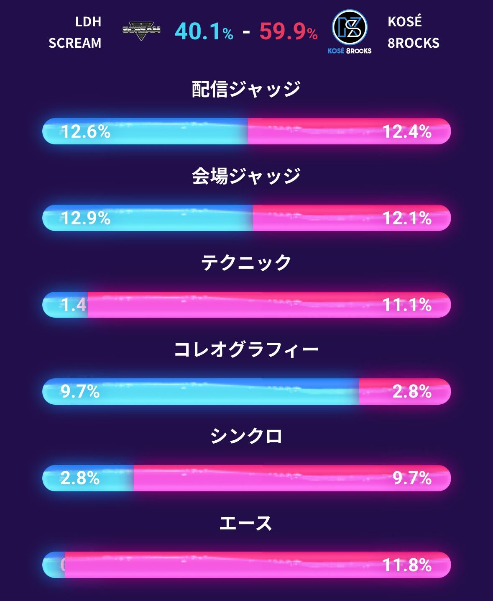

<iframe width="560" height="315" src="https://www.youtube.com/embed/OCye4gTnyJM" title="YouTube video player" frameborder="0" allow="accelerometer; autoplay; clipboard-write; encrypted-media; gyroscope; picture-in-picture; web-share" referrerpolicy="strict-origin-when-cross-origin" allowfullscreen></iframe>

<iframe width="560" height="315" src="https://www.youtube.com/embed/3QgZjPG5GBs" title="YouTube video player" frameborder="0" allow="accelerometer; autoplay; clipboard-write; encrypted-media; gyroscope; picture-in-picture; web-share" referrerpolicy="strict-origin-when-cross-origin" allowfullscreen></iframe>

名勝負多かった〜！！今シーズン最後（チャンピオンシップ除く）に相応しいラウンドだった
体感今までで一番疲れた笑　それだけ感情を揺さぶられたというか、いい意味でどのチームが勝っても嬉しいし、どのチームが負けても悔しかった　Dリーグ好きでよかった

<iframe width="560" height="315" src="https://www.youtube.com/embed/wvVkskihUVA" title="YouTube video player" frameborder="0" allow="accelerometer; autoplay; clipboard-write; encrypted-media; gyroscope; picture-in-picture; web-share" referrerpolicy="strict-origin-when-cross-origin" allowfullscreen></iframe>

モノリスの作品で過去一くらった
途中涙出そうになって、人間の動きだけでここまで感情が動くって本当にすごいことだなと思った
でも負けた理由もわかるというか、（相手のdipもいい作品だったのは大前提で）採点項目『だけ』で見たら確かにそうなってしまうよね泣　散々言われてるけど、今シーズンのジャッジルールとモノリスの作風が致命的に合ってない　
でもコレオは取ってよかったと思うんだけどな〜泣　今ラウンドの個人的MVDはYOICHIROさん！
あと対dip BATTLES戦でショータイトルが『Dip into Red』なの挑発しててかっこよすぎる　Dリーグでレッドといえばモノリスなので

<iframe width="560" height="315" src="https://www.youtube.com/embed/4ZqGIzjzvxk" title="YouTube video player" frameborder="0" allow="accelerometer; autoplay; clipboard-write; encrypted-media; gyroscope; picture-in-picture; web-share" referrerpolicy="strict-origin-when-cross-origin" allowfullscreen></iframe>

<iframe width="560" height="315" src="https://www.youtube.com/embed/y1-ETlWXQLA" title="YouTube video player" frameborder="0" allow="accelerometer; autoplay; clipboard-write; encrypted-media; gyroscope; picture-in-picture; web-share" referrerpolicy="strict-origin-when-cross-origin" allowfullscreen></iframe>

コーセーvsエルスク　いや〜いい勝負だった！！
コーセーはチャンピオンシップ確定してる強豪チームで、エルスクは今シーズン参入の超若手（平均年齢17歳！）チームなんですよ　新規参入チームは初シーズン苦戦するので、今回も正直コーセーの爆勝ちかな～と思っていたのですが…いい意味で裏切られた
コーセーの勝ちではあるけど、ジャッジの数値↓を見てDリーグってガチで面白い！！と思えた

- まず配信ジャッジと会場ジャッジは僅差でエルスクの勝ち　この二つはまとめてオーディエンス票と呼ばれていて、要はファン投票　コーセーはいつもわりとオーディエンス取れる方なので、エルスクが勝ったということは、つまりファンの新規参入が増えている！！いいこと！
- 次はテクニック　ブレイキン（超雑に言うとヘッドスピンとかするやつ）はテクニック本当に強いので、コーセーが取って当然というか、なんなら全取りするかと思った
- コレオグラフィー　なんとエルスクが圧倒！コレオグラフィー（雑に言うと振り付け）はエルスクの明確な強みで、ラウンドごとに試行錯誤と研鑽を重ねて成長してるのが見て分かるので、コーセー相手でもワンチャンあるかも…とは思ってたけど、まさかここまで取ると思わなかった　すごい
- シンクロ　これはコーセー取るよね　ブレイキンはテクニック取れる代わりにシンクロがきつい…と思われがち（別のブレイキンやってるチームは正直シンクロで点落としまくってる）だけど、コーセーは攻めつつ点も取っててやばい
- エース　これは～～～そりゃそう　エルスクが悪かったとかじゃ全然なくて、年季、経験、ステージ慣れの差　ISSEI余裕出しつつカマしててかっこよかったし、RYU-SEIも魂感じてアツかった😭

なんかこう…点数だけ見たら接戦ではないし、テクニックシンクロエースはコーセーが圧倒してるけど、この2チームだけじゃなくて、**Dリーグ全体の今後の可能性**を感じさせる勝負というか　取るところはベテランのコーセーがしっかり取りつつ、エルスクも食らいついてる
コーセーは強豪なので、エルスク相手なら多少手抜いても勝てたと思うんですよ　でもそうせずに、コーセーにとっても新しい作品にチャレンジして、『勝負』を仕掛けた　ダンサーとしてのプライド感じてめちゃくちゃいいな…と思った　いい勝負見せてくれてありがとう

<iframe width="560" height="315" src="https://www.youtube.com/embed/hbcR0-S-Zqo" title="YouTube video player" frameborder="0" allow="accelerometer; autoplay; clipboard-write; encrypted-media; gyroscope; picture-in-picture; web-share" referrerpolicy="strict-origin-when-cross-origin" allowfullscreen></iframe>

<iframe width="560" height="315" src="https://www.youtube.com/embed/AYj9igj5Xks" title="YouTube video player" frameborder="0" allow="accelerometer; autoplay; clipboard-write; encrypted-media; gyroscope; picture-in-picture; web-share" referrerpolicy="strict-origin-when-cross-origin" allowfullscreen></iframe>

レジットvsアイムーンも名勝負だった～～チャンピオンシップ確定同士の対決！！
レジットは三連覇に王手をかけている†最強†といっても過言ではないチームで、作品のクオリティも毎回すさまじく（海外進出もしてる）、*え～とこれにどうやって勝つ？*😅っていつも思ってしまうし、実際リーガーの人も言ってた　今回もそんな感じだったけど、オーディエンスなかったらアイムーンの勝ちだったんだよね～いい勝負だった
アイムーンはアイムーンというチームのコアというか、根幹部分にかなり近い作品って感じでよかったし、MEME無双だった　MEMEが一人で出てきた瞬間すべてがMEMEのためのステージになるのやばい　DリーグならぬMEMEリーグだよもう

<iframe width="560" height="315" src="https://www.youtube.com/embed/GrEUBzVqr4Q" title="YouTube video player" frameborder="0" allow="accelerometer; autoplay; clipboard-write; encrypted-media; gyroscope; picture-in-picture; web-share" referrerpolicy="strict-origin-when-cross-origin" allowfullscreen></iframe>

DYMvsレイザーズ　またまた名勝負だった！！こっちもチャンピオンシップ確定同士の対決！
DYM　Keitoric作品ぽかったけどどうなんだろう？クネクネしてたらKeitoric作品だと思っている（怒られ）服の模様に合わせて腕で五角形作るところタットぽくて面白かった！個人的にDYMの作品で一番ワクワクしたかも
負けたときのKeitoricって超悔しそうだし辛そうで見てるこっちもウオオ～😭てなる　前にMVD取ったときのインタビューで「自分がやりたいダンスをやって、それが評価されたことが本当に嬉しい」的な話を泣きながらしてたのが記憶に残りすぎてるし、今回特にKeitoric感全開だったから

<iframe width="560" height="315" src="https://www.youtube.com/embed/M8N5BWtN8_Q" title="YouTube video player" frameborder="0" allow="accelerometer; autoplay; clipboard-write; encrypted-media; gyroscope; picture-in-picture; web-share" referrerpolicy="strict-origin-when-cross-origin" allowfullscreen></iframe>

最近毎日Keitoricのストレッチ講座見ながらストレッチしてるから一方的に恩感じてるのもある（？）スタジオがスケスケすぎて、ストレッチしてるオシャレ男三人組を通行人がめちゃくちゃガン見してて面白いのでおすすめです　もちろんストレッチの内容もいいし、体柔らかすぎてなんかもはや絡まってるKeitoricが見れる

<iframe width="560" height="315" src="https://www.youtube.com/embed/ZIqfcPiqT5E" title="YouTube video player" frameborder="0" allow="accelerometer; autoplay; clipboard-write; encrypted-media; gyroscope; picture-in-picture; web-share" referrerpolicy="strict-origin-when-cross-origin" allowfullscreen></iframe>

レイザーズ最初全員でフットワークやるのかっこよかった〜〜入場のときにYOUTAがフットワークに注目！って言ってたけど、まさか皆でやると思わなかった
INFINITY TWIGGZのエース、魂！！て感じで毎回大好き　レイザーズが前シーズン負け続けてたとき、良い意味で敗者の悔しさとか鬱憤とかをダンスから感じてたんですよ　『無関心こそ反骨精神の好物』とか『底に行けば行くほど湧き上がってくる理想』（これは今シーズンの最初あたり）とか、負けてる側にしか踊れない歌詞で踊ってた　それが今シーズンブロック1位に輝いて、今回のINFINITY TWIGGZのエース見てああ勝者として踊れるようになったんだな…と実感して泣きそうになったというか　上手く言えないけど
今シーズンこういう強めのクラシック曲多かった気がする　今ROUNDのモノリスもそうだし、前回のルクスとか前々回のアルトリとか　かっこいい

アルトリ解散じゃなくてよかった😭ライフルアルトリズムはなくなるし、アンカーアルトリズム（仮）が今までのアルトリと同じコンセプトで行くかは分からないし、メンバーも変わるかもしれないけど　それでもDリーグに残るってだけで嬉しい　
新スポンサーAnkerなのびっくりした　スピーカー愛用してます　Dリーグでもよろしくお願いします（？）ところで去年リコール回収に出したモバイルバッテリーはいつ戻ってくるのでしょうか…

次は今シーズンの好きな作品まとめ書く💪まだチャンピオンシップ残ってるけど、レギュラーシーズンとしての区切りで
16チーム×7ラウンドなので、半年間でなんと**112作品**を見てきたらしい　素晴らしい舞台で素晴らしい作品を見せてくれることに感謝しかない　ずっと続いてほしいよ～～～　このコンテンツ好きになれてよかったな…と心から思えたシーズンだった
