こんにちは！
突然ですが、**Dリーグ**をご存知ですか？

サッカーならJリーグ、麻雀ならMリーグ、バスケットボールならBリーグ……
DリーグのDは**Dance**のD！国内プロダンスリーグです！

正直、知名度はまだまだ高くないかな？と思います。
でも、Dリーグってめちゃくちゃ面白いんです！
16チームそれぞれに、そしてすべてのダンサーに、輝く個性と魅力があります。
もっと広まってほしいです。色んな人とDリーグの話がしたいです。
そこで当記事では、Dリーグを構成する16チームを中心に、その魅力を紹介していこうと思います！
少しでもDリーグを知るきっかけになれば幸いです✨

## はじめに

🌟Dリーグでは、各チームが**ショーケース**（ダンスパフォーマンス）を披露して、その完成度を競います！
総当たりで全8ラウンドを戦い、上位チームがチャンピオンシップに出場します。

🌟全チームが「スポンサー名＋チーム名」で呼ばれています。
例：avex ROYALBRATS、KOSÉ 8ROCKS

🌟チーム名、チーム写真、簡単な解説、個人的おすすめショーケースを紹介していきます。
ショーケースは**約2分**程度です。
気になったチームだけでも！！見てもらえると嬉しいです！！

🌟掲載している画像の権利は各権利者に帰属します。本記事はDリーグ紹介を目的としたファン制作コンテンツです。画像はD.LEAGUE公式サイトより引用し、出典元URLは画像下部に記載しています。

……さて、前置きが長くなってしまいましたが、ここからはいよいよ各チームの紹介です！
この記事が、素敵なチームとの出会いのきっかけになれば嬉しいです🌼

## チーム紹介！前半戦（01～08）

### 01. avex ROYALBRATS / エイベックス　ロイヤルブラッツ

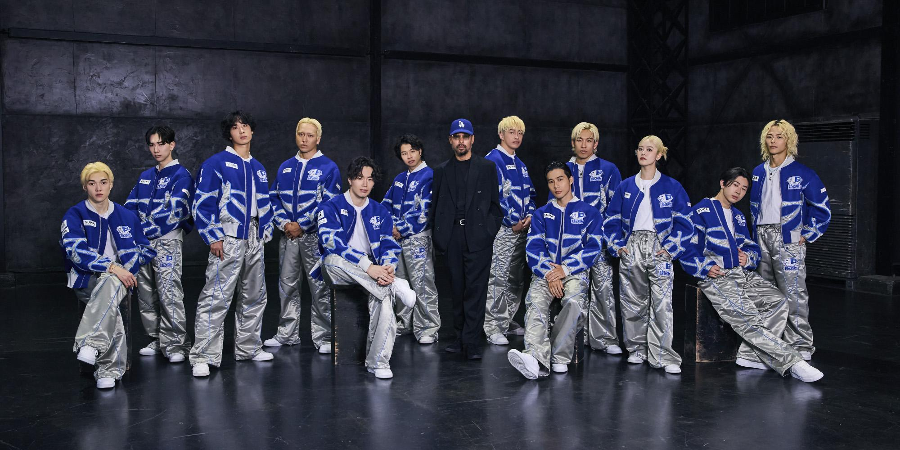

出典元：https://home.dleague.co.jp/teams/tah0/

トップバッターは**avex ROYALBRATS**です！
このチームは、avexというスポンサーのイメージ通りの、エンターテインメント集団です🕺✨

なんと、曲の代わりに漫才を流して踊ったことがあります。
ボカロ曲で、キャラTを着てうちわを振り回して踊っていたこともあります。
と思いきや、クールなHIPHOPやR&Bで、直球に超かっこいいショーケースを見せてくれたりもします。
どんなショーを見せてくれるのか予測不可能、まるでプレゼントボックスのようなチームです！

おすすめショーケース！『**Take Off**』
直球でかっこいいavex ROYALBRATSです！
ラウンド8、今シーズンラストの作品にふさわしい、ロイヤルブラッツらしさが存分に味わえる作品です。
カウボーイ衣装でロデオっぽい振りやアクロバットを入れつつ、少しとぼけた演出もあって遊び心に溢れています。
avexだからか分かりませんが、このチームは歌もののショーケースが多い気がします。テーマソングも三浦大知さんの曲です。

<iframe width="560" height="315" src="https://www.youtube.com/embed/rEUYfbZrtCs" title="YouTube video player" frameborder="0" allow="accelerometer; autoplay; clipboard-write; encrypted-media; gyroscope; picture-in-picture; web-share" referrerpolicy="strict-origin-when-cross-origin" allowfullscreen></iframe>

### 02. Benefit one MONOLIZ / ベネフィットワン　モノリス

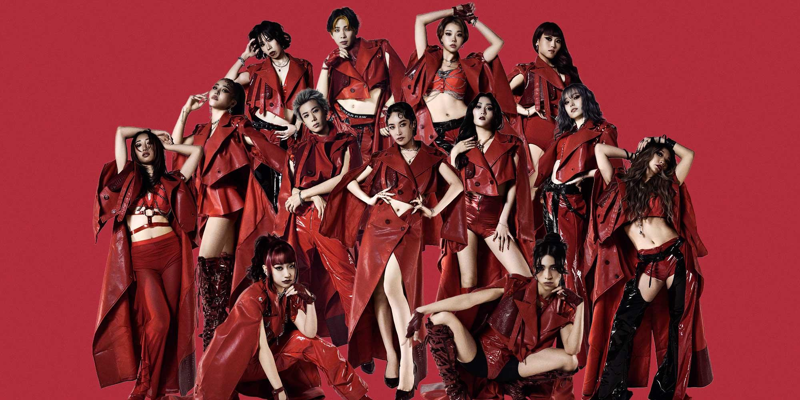

出典元：https://home.dleague.co.jp/teams/tbvh/

妖艶でゴージャスな紅い美の化身……それが**Benefit one MONOLIZ**です！

VOGUEという、LGBTQ+カルチャーにルーツを持つジャンルを主軸とするこのチームは、圧倒的な世界観のショーケースを披露してくれます！
しなやかに妖艶に、時にはドレスとタキシードを纏って社交ダンスを、時には扇子を持って華麗な舞踊を、色々なテーマを華やかに魅せてくれるチームです✨

余談ですが、チームユニフォームが二次元でしか見ないような服（上のチーム写真に近いです）で、それで周りのチームと並んで挨拶とかされているので感覚がバグります。
男性も含めて全員ハイヒールで着こなしているので、本当にすごいです。

おすすめショーケース！『**Dip into Red**』
こちらもシーズン最後のラウンド8で披露されたショーケースです！
リーダーであるYOICHIROというダンサーをピックアップした作品です。
何というか"""凄み"""の一言に尽きます。
一列に並んで足を上げるところ、Dリーグで見たことない振りで度肝を抜かれました。
このときの対戦相手がdip BATTLESというチームで、バチバチに意識している作品タイトルもかっこいいです。

<iframe width="560" height="315" src="https://www.youtube.com/embed/wvVkskihUVA" title="YouTube video player" frameborder="0" allow="accelerometer; autoplay; clipboard-write; encrypted-media; gyroscope; picture-in-picture; web-share" referrerpolicy="strict-origin-when-cross-origin" allowfullscreen></iframe>

### 03. CyberAgent Legit / サイバーエージェント　レジット

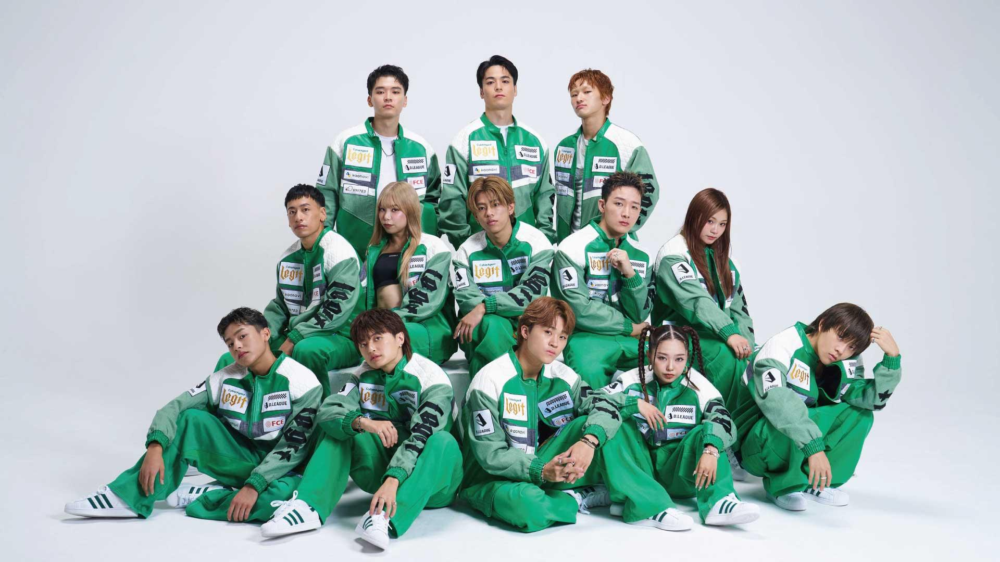

出典元：https://home.dleague.co.jp/teams/t0m9/

**CyberAgent Legit**は、何でもできるオールラウンダーなチームです！
POP（筋肉を弾くように動かすカクカクしたダンス）と、LOCK（大きく動いてピタッと止まるダンス）というジャンルを主軸にしています。
ですが、HIPHOPを入れてくるときもありますし、ド派手なアクロバットやブレイキンもします。

レジットの特徴は、ショークオリティの高さです！
ダンススキル、構成力、演出力、すべてが高水準です。
もっとも『最強』に近いチームと言っても過言ではありません。
レギュラーシーズンでは驚異の**4連覇**を達成し、昨シーズンはチャンピオンシップも制覇しています。

ただ、今でこそ最強のレジットですが、Dリーグ設立初年度に最下位を経験したチームでもあります。
レジットは比較的メンバーの入れ替えが少ないチームなので、最下位だった頃のこともきっと覚えているでしょう。
そのドラマ性も含めて、魅力的なチームだと思います。

おすすめショーケース！『**Echo Beyond Time**』
2026年5月31日に行われたチャンピオンシップの作品です！
昨シーズン完全優勝、今シーズンも無双して優勝最有力候補だったレジットですが……大波乱が起きて、なんとセミファイナルで敗退してしまいました。
こちらは敗退後の3位決定戦で披露された、本来は決勝用の作品です。
誰が見ても『ザ・レジット』。
レジットの強みや魅力、そして眩い輝きが詰まった作品です。

<iframe width="560" height="315" src="https://www.youtube.com/embed/LR_0Fr1XYSM" title="YouTube video player" frameborder="0" allow="accelerometer; autoplay; clipboard-write; encrypted-media; gyroscope; picture-in-picture; web-share" referrerpolicy="strict-origin-when-cross-origin" allowfullscreen></iframe>

### 04. dip BATTLES / ディップ　バトルズ

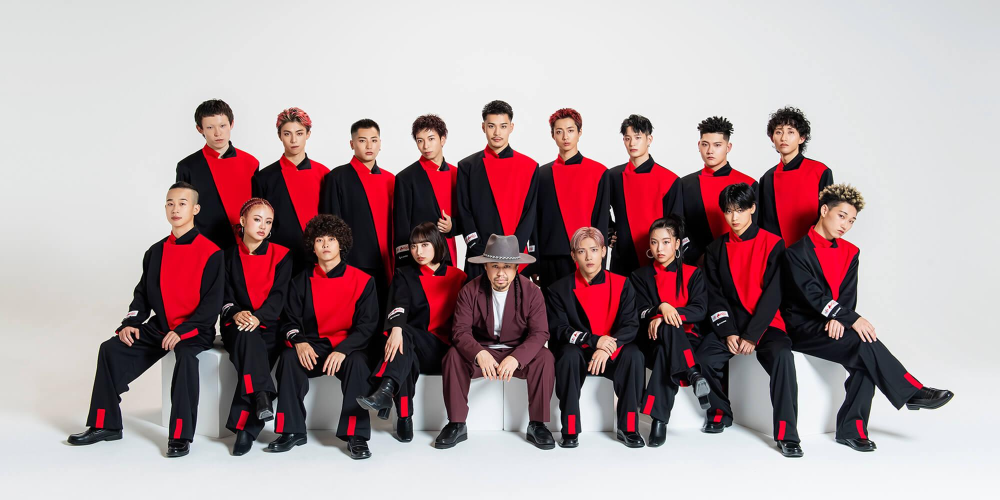

出典元：https://home.dleague.co.jp/teams/t2ls/

**dip BATTLES**は、チーム名通りダンスで真っ向勝負するチームです！
ジャンルはPOPとHOUSE（ざっくり言うと足捌きを重視するダンス）を中心としています。
曲は歌無しのビートがほとんど、小道具もほぼ使いません。
派手な演出やストーリーも組み込まず、2分間を常に全員で踊り続ける……というイメージです。

ですが、今シーズンのdipは、Dリーグ史上初！
アイドルの方（Travis Japanの宮近海斗さん）をゲストダンサーとして起用しました。
これってすごく新しくてチャレンジングな試みなんです！
正攻法で攻めつつも、Dリーグに新しい風を吹かせてくれる、素敵なチームです✨

先ほど、レジットは比較的メンバーの入れ替えが少ないと書きましたが、逆にここはメンバーの入れ替えが多いチームです。
元dipのDリーガーが各チームに散らばっていて、えっこの人も元dip！？となります。

おすすめショーケース！『**語**』
ラウンド1、開幕戦のショーケースです！
POP、HOUSE、ブレイキンが混ざり合っている、まさにdip BATTLESを『語』るような作品です。
語りすぎていて、もはや私が語ることがありません。
リーダーの健世が終始楽しそうに踊っているのが印象的です。

<iframe width="560" height="315" src="https://www.youtube.com/embed/qTI4LuB671Y" title="YouTube video player" frameborder="0" allow="accelerometer; autoplay; clipboard-write; encrypted-media; gyroscope; picture-in-picture; web-share" referrerpolicy="strict-origin-when-cross-origin" allowfullscreen></iframe>

### 05. KOSÉ 8ROCKS / コーセー　エイトロックス

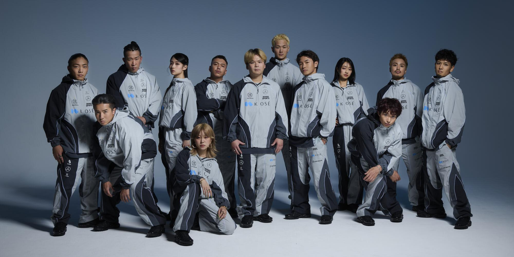

出典元：https://home.dleague.co.jp/teams/tmbp/

**KOSÉ 8ROCKS**は、オリンピック競技にも採用されたブレイキンを主軸とするチームです！
大雑把に言うと、ヘッドスピンなどのパワームーブを行うジャンルです。ダンスの中だとHIPHOPと並んで有名どころかな？と思います。
ダンスに詳しくなくても、ぱっと見て「すごい！」と思える技が多くて楽しいです。
ダンサーが大技を決めるたびに会場が沸きます✨

このチームには、ShigekixというスーパーB-boy（ブレイキンする人をB-boyとかB-girlと呼びます）が在籍しています！
Dリーグにハマるまでダンサーの知識がほぼなかった私ですが、Shigekixだけは知っていました。知名度でいうとトップレベルではないでしょうか。
もちろん、Shigekixの他もスキルフルなダンサー揃いで、このチームのショーケースは人間離れした技の連続に、2分間驚きっぱなしです。

おすすめショーケース！『**STRIKE**』
「今シーズンベストのショーケースは？」というアンケートを取ったら、間違いなくトップ3に入る作品です。
なんかもうありえない2分間です。すごすぎて変な笑いが出ます。
Dリーグを知らない知人に見せたら「人間ベイブレードがたくさん出てきて怖かった」と言われました。
途中で出てくるラスボスみたいな人がShigekixです。

<iframe width="560" height="315" src="https://www.youtube.com/embed/pLP9cp_DaCw" title="YouTube video player" frameborder="0" allow="accelerometer; autoplay; clipboard-write; encrypted-media; gyroscope; picture-in-picture; web-share" referrerpolicy="strict-origin-when-cross-origin" allowfullscreen></iframe>

### 06. LDH SCREAM / エルディーエイチ　スクリーム

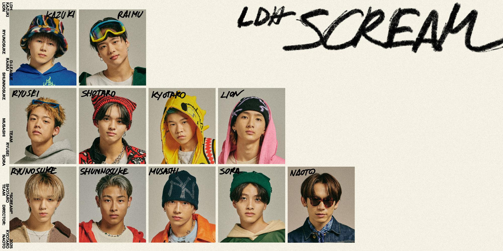

出典元：https://home.dleague.co.jp/teams/sng6/

今シーズンから新規参入した**LDH SCREAM**は、若き新星という表現がDリーグで一番似合うチームです！
LDHのメンバーがそのまま加入……ではなく、オーディションで選ばれた21歳～16歳（！）のメンバーで構成されています。（写真の右下はプロデューサーの方です）

このチームの強みは、審査項目の一つである『コレオグラフィー』です！
コレオグラフィーというのは、振り付けやフォーメーション、ステージングなどのことです。
上のコーセーで言うと、2分間ずっと人間ベイブレードが回っているだけでは、凄くても作品にはなりません。
曲への合わせ方とか、展開、照明、小道具の有無など、考えることはたくさんあります。
ざっくりですが、その辺がコレオグラフィーです。

このチームの作品はどれも綺麗にまとまっていて、若さが良い味出してるって感じです。フレッシュで眩しい。
LDHという先入観もありますが、ミュージックビデオっぽさを感じるときがあります。
わかりやすくかっこいい！と思えるチームです。

おすすめショーケース！『**I know**』
この作品は相手がレジットだったのですが、もしかしてワンチャンある！？と思ってしまったくらい個人的に好きな作品です✨
とにかく見やすいです。ダンサー8人が同時に踊っていると、今ってどこ見るのが正解！？となってしまうこともあるのですが、スクリームはそれがほとんどないように思います。

<iframe width="560" height="315" src="https://www.youtube.com/embed/Fx1RMF0jczo" title="YouTube video player" frameborder="0" allow="accelerometer; autoplay; clipboard-write; encrypted-media; gyroscope; picture-in-picture; web-share" referrerpolicy="strict-origin-when-cross-origin" allowfullscreen></iframe>

### 07. List::X / リスト　エクス

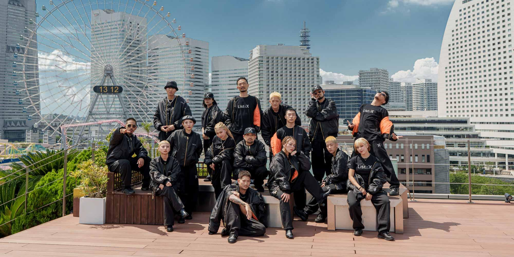

出典元：https://home.dleague.co.jp/teams/h7x3/

**List::X**は、横浜を拠点としているアツい横浜推しのチームです！
もちろんチーム写真の背景も横浜です。プロモーションムービーは横浜マリンタワーで撮影、テーマソングにも横浜を思わせる歌詞があります。

ジャンルはHIPHOPですが、ジャンルに囚われない幅広いショーが持ち味です。
ところで上の写真……自由の波動を感じませんか？（特に右上から）
このチームは、Dリーグ内でも特に『個』が強いチームです。
リーグ外でもバトルなどで活躍されているダンサーが集まっています。
それはどのチームもそうなのですが、リストエクスの特徴は、良い意味でその『個』を消せていないところだと思います。
一人一人の個性を存分に出しつつ、一つの作品として成立させる。たまに揃ってないけど、バラバラではない。
一風変わった作品、一風変わった魅力を届けてくれるチームです✨

余談ですが、リストエクスのYouTubeはツッコミが不在で、全体的にフワフワしています。

おすすめショーケース！『**Unconditional**』
サムネイルに映っている、FatSnakeというダンサーを中心に据えた作品です。
Dリーグではかなり珍しい、しっとり系ラブソングです。
ラスト、一列に並んだユニゾンなのですが……ぜんっぜん揃ってないんですよね。
振りは同じはずですが、全員マジで好き勝手踊ってます。
でも、それが本当にかっこいいんです！
揃ってないのに一体感がある、かっこいいと思わせてくれる、このチームにしかできない作品だと思います。

<iframe width="560" height="315" src="https://www.youtube.com/embed/LNroEdrkgAg" title="YouTube video player" frameborder="0" allow="accelerometer; autoplay; clipboard-write; encrypted-media; gyroscope; picture-in-picture; web-share" referrerpolicy="strict-origin-when-cross-origin" allowfullscreen></iframe>

### 08. Medical Concierge I’moon / メディカルコンシェルジュ　アイムーン

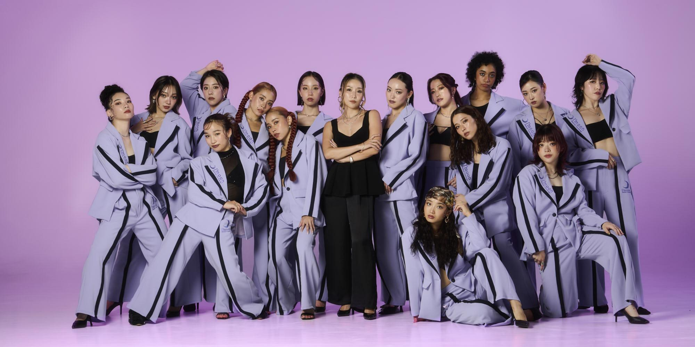

出典元：https://home.dleague.co.jp/teams/thrd/

**Medical Concierge I’moon**は、Dリーグで唯一、女性のみで構成されたチームです！
ジャンルはWAACK（腕を大きく振り回すダンス）やLOCK、JAZZ、FUNKなど、作品の雰囲気に合わせてさまざまです。
しなやかで、変幻自在の美しさを持ち味とするチームです🌙

Dリーグでは、審査項目の一つに『シンクロ』という項目があります。
作品内に、全員の動きを揃えることを重視した約10秒間のパートを入れて、その美しさや難易度をジャッジする、というものです。
アイムーンはシンクロがめちゃくちゃ強いんです。堂々の1位、なんとシーズン無敗です。
指先まで寸分のズレなく揃えられたシンクロは、見ていて恐ろしさすら感じます。

今シーズンはそのシンクロを武器に、初めてチャンピオンシップに進出。
準決勝でなんと、昨年王者レジットを下しました！
まさかのジャイアントキリングです。
決勝では惜しくも僅差で敗れてしまい、2位という結果になりましたが、それでも大躍進です。
来シーズンのアイムーンがどんな進化を遂げるのか、早くも楽しみです✨

おすすめショーケース！『**FULL MOON LADY**』
アイムーンらしいエネルギッシュな作品です！
このチームの強みであるシンクロも絶好調で、もはやロボット？と思うくらい揃っています。
曲をよく聞くと、シンクロ直前に「ｽｰﾊﾟｰｼﾝｸﾛ~（低音ボイス）」と言っていてちょっと面白いです。実際、名前負けしないスーパーシンクロです。

<iframe width="560" height="315" src="https://www.youtube.com/embed/q24Y2YNxl_E" title="YouTube video player" frameborder="0" allow="accelerometer; autoplay; clipboard-write; encrypted-media; gyroscope; picture-in-picture; web-share" referrerpolicy="strict-origin-when-cross-origin" allowfullscreen></iframe>

ここまでで8チーム！
読んでくださった方、本当にありがとうございます✨
後半も個性的で素敵なチーム揃いです。引き続き、見てもらえたら嬉しいです🙏

## チーム紹介！後半戦（09～16）

### 09. CHANGE RAPTURES / チェンジ　ラプチャーズ

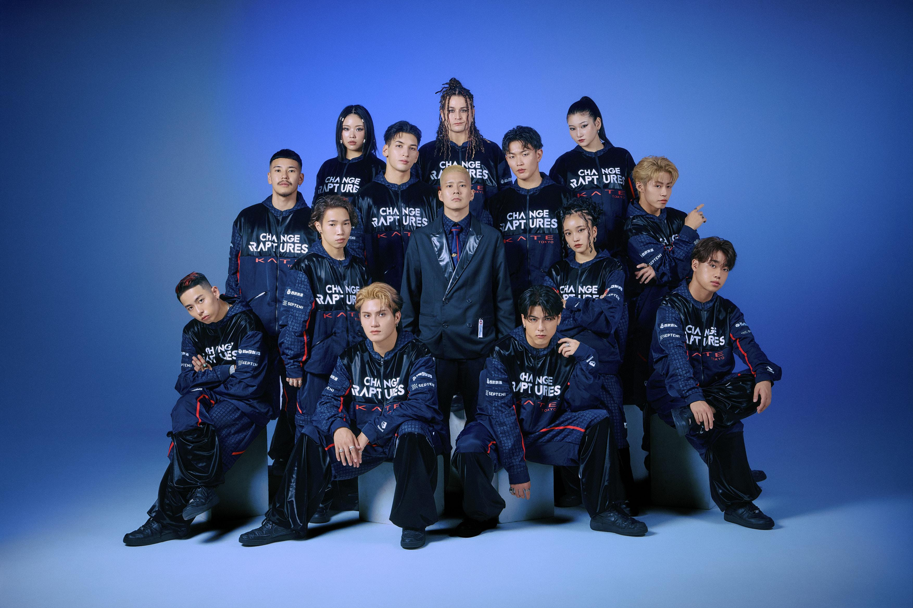

出典元：https://home.dleague.co.jp/teams/tqog/

Dリーグのショーケースでは、小道具を使うことができます🪄
使い方はチームによってさまざま。たくさん使うチームもいれば、全く使わないチームもいます。
**CHANGE RAPTURES**は、小道具演出のスペシャリスト集団です！

巨大鏡や巨大磁石を持ち込むのは序の口、ステージの中央に大木を生やしたり、軽トラを乗り回したり、やりたい放題アイデアが凄いです。
なんと、作成までメンバーがやっているらしいです。

ですが、もちろんただの小道具屋さんではなく、ショーのテーマを表現するために、ダンスと同じくらい小道具にも力を入れている……という印象です。
小道具を使いすぎて、ダンスがかき消されてしまっては意味がありません。そこのバランス感覚が凄いチームなんだと思います。
また、今日は小道具なし！ダンスのみで勝負！！のときもあるので、いい具合にメリハリが効いています。

おすすめショーケース！『**筋魂漢魂**』
笑いを取りに来ている作品です。
先ほど触れた通り、ショーケースでは小道具を使うことができます。
だから、ステージにダンベルや鉄棒を持ち込んで筋トレしてもOKなんです✨
……いつか重量制限とか課されないか心配です。

<iframe width="560" height="315" src="https://www.youtube.com/embed/t-QACUjEoTA" title="YouTube video player" frameborder="0" allow="accelerometer; autoplay; clipboard-write; encrypted-media; gyroscope; picture-in-picture; web-share" referrerpolicy="strict-origin-when-cross-origin" allowfullscreen></iframe>

### 10. DYM MESSENGERS / ディーワイエム　メッセンジャーズ

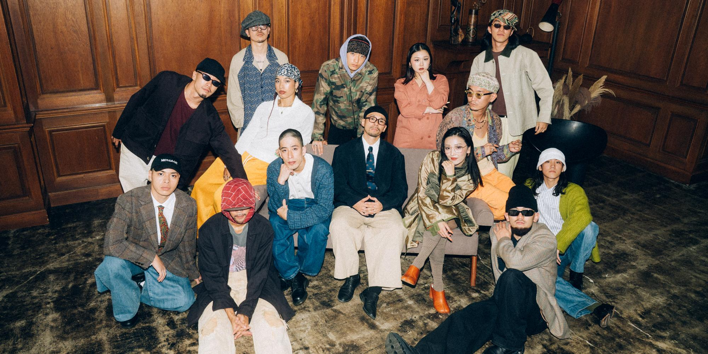

出典元：https://home.dleague.co.jp/teams/t5fa/

写真、とにかくオシャレですよね。
YouTubeも全部オシャレフィルターがかかっていて凄いです。ストレッチ動画すらオシャレです。

**DYM MESSENGERS**は、前半で紹介したリストエクスと同じく、個々のスキルが突出しているチームです！
審査項目のテクニックとサイファー（年に一度の個人戦）では、16チーム中1位という恐るべき成績を収めています✨

このチームの雰囲気を言葉にするのは難しいです。
作品が難解だとか、そういうわけではありません。
むしろ言いたいことがビシバシ伝わってきます。
「俺たち/私たちがやりたいダンスをやる」

Dリーグは審査制なので、点を取りやすい要素というのはどうしても存在します。
音楽は緩急をつけた方が勝ちやすいとか、難しいアクロバットを入れてテクニックを稼ぐとか。
DYMはそれに対抗しようとしている……と決めつけるのは危ないですが、メンバーの過去の発言を鑑みても、疑問を抱いているのは確かです。
他とは少し違う角度からDリーグに挑んでいる、オシャレでダークなチームです。

おすすめショーケース！『**TRIBE**』
DYMにはKeitricという、Dリーグでも1、2位を争うほど個性的なダンサーがいます！
冒頭で浮いたり、エースで肩を外したりしている坊主の人です。
この作品はおそらくKeitricが製作に携わっていて、かなり尖ったショーだったのですが、見事勝利を収め、KeitricはMVD（ラウンド最優秀ダンサー）を獲得しました。
その際のインタビューで、「僕たちは僕たちのままで勝ちたかったから嬉しい」と涙ぐみながら語っていたのがとても印象的でした。

<iframe width="560" height="315" src="https://www.youtube.com/embed/chus5IiD6LA" title="YouTube video player" frameborder="0" allow="accelerometer; autoplay; clipboard-write; encrypted-media; gyroscope; picture-in-picture; web-share" referrerpolicy="strict-origin-when-cross-origin" allowfullscreen></iframe>

### 11. FULLCAST RAISERZ / フルキャスト　レイザーズ

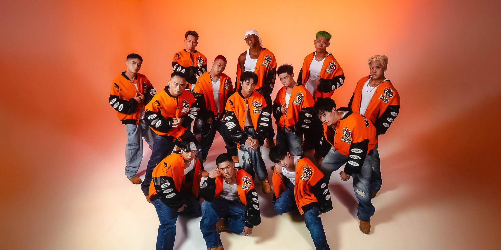

出典元：https://home.dleague.co.jp/teams/ttr7/

**FULLCAST RAISERZ**は、Dリーグで唯一、KRUMPというジャンルで戦っているチームです！
このチームを語る上で、KRUMPのルーツは避けて通れません。
2000年代初頭ロサンゼルスの、もっとも犯罪発生率が高い地区で生まれたダンスです。
ストリートでの抗争やドラッグの代わりに、ダンスで自分を表現しようという思いから始まったそうです。

そんなKRUMPを武器とするレイザーズは、自他共に認める『**肉体派舞闘集団**』です。
鼓舞するように足を踏み鳴らし、胸を突き上げ、勢いよく腕を振り下ろす。
全身で感情を叫んでいるのが伝わってきます。時には本当に叫んでいます。
ですが、力強さだけのチームではありません。エモーショナルな作品やオシャレ系の作品も得意で、表現力の広さを感じさせてくれるチームです✨

2026年5月31日、レイザーズはチャンピオンシップ優勝を果たしました！
レギュラーシーズン1位も獲っているので、25-26シーズンの完全王者です👑
ですが、その道のりは決して順風満帆ではありませんでした。
なんと昨シーズンは最下位だったんです。
その屈辱や鬱憤、悲しみを晴らすように、今シーズンは数々の傑作を生み出し、ついに悲願の優勝を手にしました。
ドラマチックという言葉では足りないほどの感動を届けてくれたチームです！

おすすめショーケース！『**GONG**』
ラウンド1、開幕戦です。
レイザーズの作品はどれもキャッチーなので迷いましたが、紹介記事という趣旨にはこれが一番合っていると思います。
【2分でわかるKRUMP入門】みたいな作品です。
KRUMPの特徴や魅力が、最初から最後まで余すところなく詰まっています！
**一人のタンクトップを全員で破る**というありえないシーンがあるのですが、それすらかっこよくて凄いです。
ちなみに、Dリーグで唯一脱ぐチームでもあります。

<iframe width="560" height="315" src="https://www.youtube.com/embed/S-fhmiYLYow" title="YouTube video player" frameborder="0" allow="accelerometer; autoplay; clipboard-write; encrypted-media; gyroscope; picture-in-picture; web-share" referrerpolicy="strict-origin-when-cross-origin" allowfullscreen></iframe>

### 12. KADOKAWA DREAMS / カドカワ　ドリームズ

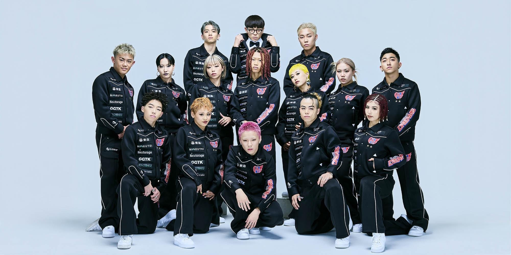

出典元：https://home.dleague.co.jp/teams/twme/

**KADOKAWA DREAMS**は、チームの運用形態が他と大きく違います。
メンバーがランク付けされていたり、ゲストダンサー制度を独自に運用していたり……
チームというより、組織といった方が近いかもしれません。
登録外のメンバーも含めると、総人数がもっとも多いチームだと思います。

なぜ他チームと違うのか？
勝利のためです。
カドカワドリームズは、Dリーグでもっとも「勝利への執念」が強いチームです🎖
そしてそれを一切隠さず、チームカラーにしています。危うい魅力を持つチームです。

勝利への執念は、もちろん作品にも表れています。
このチームの作品は、2分間の密度がすさまじく高いです。
HIPHOPをベースに、人間離れしたアニメーション（ざっくり言うとロボットダンスのような動き）、リスキーなアクロバット、ありとあらゆる小道具など、見る側もずっと気の抜けないショーを披露してくれます。
「見る者を絶対に楽しませる」という、ヒリヒリしたプライドを感じます✨

おすすめショーケース！『**零ノ刻**』
開幕戦の作品です。
KADOKAWA DREAMSは、Dリーグでもトップクラスで『和』のテーマを得意とするチームです。
障子を持ち込んできたことは過去にもあったのですが、今回は更にパワーアップしています。

<iframe width="560" height="315" src="https://www.youtube.com/embed/dMJnMAR3mO8" title="YouTube video player" frameborder="0" allow="accelerometer; autoplay; clipboard-write; encrypted-media; gyroscope; picture-in-picture; web-share" referrerpolicy="strict-origin-when-cross-origin" allowfullscreen></iframe>

そしてどうしても、もう一つ紹介したい作品がありまして……
おすすめショーケース番外編『**和魂躍彩**』
私がDリーグにハマったきっかけの作品です。
残念ながら、今は公式YouTubeでは見れません。新シーズンが始まると、前シーズンの動画がYouTubeから消されてしまうんです😔（公式アプリで見れます）
ただ、Dリーグは観客の撮影とアップロードを許可しています。この作品だけ、ファンの方が撮影された動画を紹介させてください。
この作品を初めて見たときの衝撃は、数々の作品を見た今でも鮮明に覚えています。
また、会場の歓声もそのまま入っているので、Dリーグの実際の空気感もよくわかると思います🌟

<iframe width="560" height="315" src="https://www.youtube.com/embed/H1OPmOVp3tI?start=37" title="YouTube video player" frameborder="0" allow="accelerometer; autoplay; clipboard-write; encrypted-media; gyroscope; picture-in-picture; web-share" referrerpolicy="strict-origin-when-cross-origin" allowfullscreen></iframe>

### 13. LIFULL ALT-RHYTHM / ライフル　アルトリズム

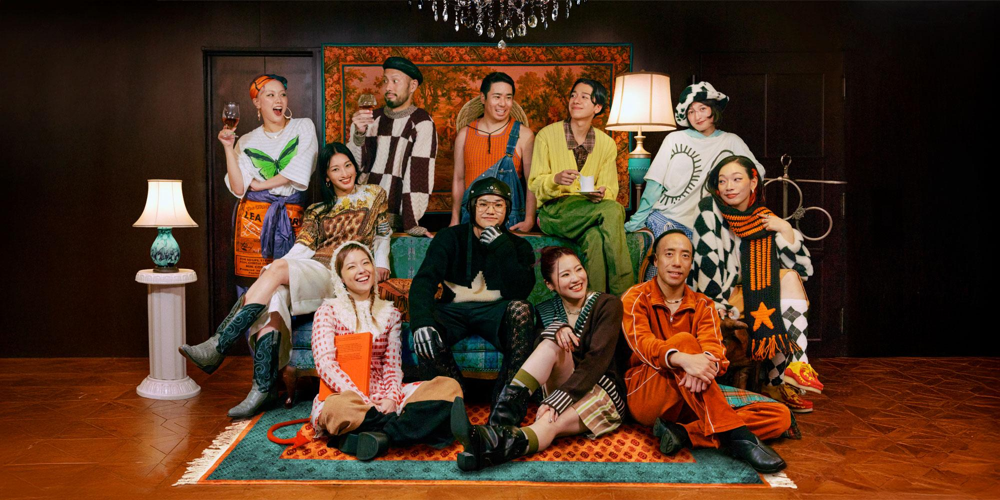

出典元：https://home.dleague.co.jp/teams/tl6e/

次に紹介するのは、劇団・**LIFULL ALT-RHYTHM**です！
このチームは、舞台のようにストーリー性のある作品が特徴です。
約2分という短い時間で、時にはピースフルに、時にはダークに、色々なショーを魅せてくれます✨

このチームのダンサーたちは、まるで舞台の役者や登場人物のようにステージを駆け回ります。
ベンチに座って新聞を読み、着ぐるみを着て雨に打たれ、助けを求める人がいれば戦隊レンジャーに変身します。
ピースフルな作品では、カラフルで個性豊かな衣装を纏い、さまざまな小道具を使いこなします。
逆に、社会問題などのシリアスなテーマを扱うときは、黒一色や白一色の衣装で、ダンスにフォーカスした作品が多いです。
入場のとき、一目で今日は楽しいアルトリだ！今日は黒アルトリだ！と分かるので、踊る前からワクワクします。

おすすめショーケース！『**FOREVER**』
**FOREVER, LIFULL ALT-RHYTHM!**
LIFULL ALT-RHYTHMは、25-26シーズンをもってスポンサーLIFULLとの契約を終了しました。それに伴ってチーム活動も終了します。
これは正真正銘、アルトリの最後の作品です。
ザ・アルトリとも言えるシアトリカルな展開に、感情の詰まったエース。
そして、数年間を共にしたテーマソングのフレーズが、後半でそのまま使われています。

どのチームもDリーグに不可欠ですが、アルトリは特に『アルトリにしかできない作品』が多かったと思います。
「見る人を笑顔に」「人生をさらに豊かに楽しむきっかけを届けます」
その言葉通り、感情を揺さぶるショーケースをたくさん届けてくれました。
LIFULL ALT-RHYTHMがDリーグで放っていた輝き、そして作品を見た人が感じた感動は、これからも決して色褪せることはないでしょう。

<iframe width="560" height="315" src="https://www.youtube.com/embed/yy9EJTS6-QQ" title="YouTube video player" frameborder="0" allow="accelerometer; autoplay; clipboard-write; encrypted-media; gyroscope; picture-in-picture; web-share" referrerpolicy="strict-origin-when-cross-origin" allowfullscreen></iframe>

### 14. M＆A SOUKEN QUANTS / エムアンドエー　ソウケン　クオンツ

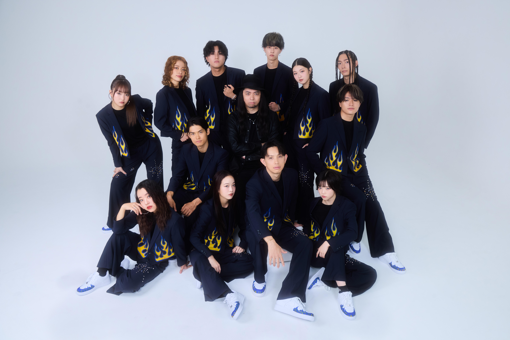

出典元：https://home.dleague.co.jp/teams/tv2x/

**M＆A SOUKEN QUANTS**は、アニメーションというスタイルを主軸とするチームです！
アニメーションという名前の通り、まるでアニメのキャラクターのような、摩訶不思議な動きをします。
イメージでいうと、ロボットダンスに近いです。

LDH SCREAMと同じく、今シーズン新規参入したチームです。
一年目と言うこともあり、まだまだ未知数な部分も多いですが……
小道具はほぼ使わず、直球でダンスでモチーフを表現する作品が多かったように思います。
何かを視覚的に表現するといった点では、アニメーションスタイルってめちゃくちゃ強そうですよね。
ヒューマノイド、スペースシップ、ゲイザーなど、SFチックな作品が多かったのも個人的に好きなポイントです。
人間離れした動きが存分に活かされていて、次はどんな展開になるんだ！？と画面に釘付けでした。

余談ですが、テーマソングが超かっこいいです。
負けかけていた主人公がアツい大逆転を起こした瞬間に流れ出すタイプの曲です。

おすすめショーケース！『**HUMANOID**』
ヒューマノイド、アニメーションにぴったりすぎるテーマです。
真ん中のサングラスの男性はゲストダンサーで、チームのクリエイティブディレクターも務めている方なのですが、**ゴリキング**というまさかの名前も相まってとても記憶に残っています。
ゴリキング作品好きなので、来シーズンでも見たいです。更に欲を言えばチームに正式加入してほしいです🦍👑（今はゲストダンサーで出てる）

<iframe width="560" height="315" src="https://www.youtube.com/embed/1_PW2C9p6LI" title="YouTube video player" frameborder="0" allow="accelerometer; autoplay; clipboard-write; encrypted-media; gyroscope; picture-in-picture; web-share" referrerpolicy="strict-origin-when-cross-origin" allowfullscreen></iframe>

### 15. SEGA SAMMY LUX / セガサミー　ルクス

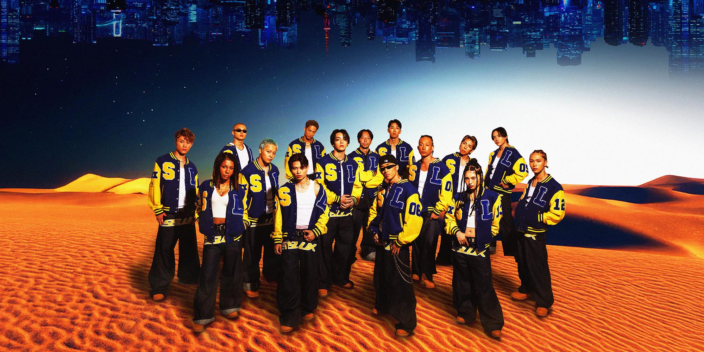

出典元：https://home.dleague.co.jp/teams/t1kf/

**SEGA SAMMY LUX**は、ニュージャックスウィングと呼ばれるスタイルを軸としています。
アメリカで1980年代に流行した、HIPHOPとR&Bが混ざった音楽ジャンルをルーツに持つスタイルです。
だからでしょうか？ルクスのダンスには、どこか懐かしさというかレトロな空気を感じます。

そんなレトロさに反して、作品にはチャレンジングな要素が多いです✨
アクロバットで高く高く飛んだり、小道具を素早く入れ替えながらダンスに組み込んだり、キョンシーに扮して棺から出てきたり、ステッキやフープを使ったり……遊び心たっぷりです。
ゴリゴリのニュージャックスウィングを踊るときの硬派な魅力と、色々なテイストにチャレンジするショーマンとしての魅力を兼ね備えたチームです。

テーマソングの途中で、セーガー🎵とおなじみのサウンドロゴが入るのがオシャレです。
入場時にも流れるので結構目立ちます。スポンサーの使い方が上手いです（？）

おすすめショーケース！『**ありがとう！〜感謝の光**』
個人的に、今シーズンでもっともルクスらしい作品です。
エネルギッシュでレトロな、一癖あるかっこよさ。
それと、ルクスはレジットと同じくメンバーの入れ替えが少ないチームです。
年齢層が広いのも相まって、ファミリー感があるんですよね。それがよく出ている作品な気がします。
何よりメンバーが楽しそうなのが一番好きです。ありがとう！

<iframe width="560" height="315" src="https://www.youtube.com/embed/Jr-2aQO-ncg" title="YouTube video player" frameborder="0" allow="accelerometer; autoplay; clipboard-write; encrypted-media; gyroscope; picture-in-picture; web-share" referrerpolicy="strict-origin-when-cross-origin" allowfullscreen></iframe>

### 16. Valuence INFINITIES / バリュエンス　インフィニティーズ

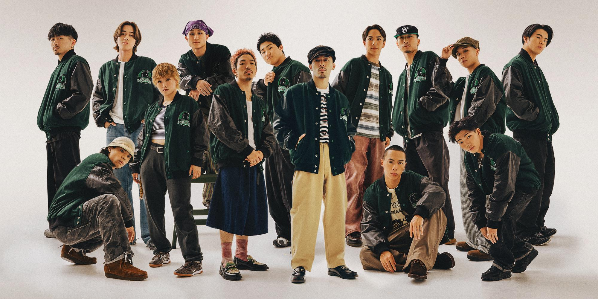

出典元：https://home.dleague.co.jp/teams/t2ui/

いよいよラストは、**Valuence INFINITIES**！
得意ジャンルはブレイキン、HOUSE、HIPHOP。
Dリーグでブレイキンといえば、こことコーセーエイトロックスです。
ライバルのコーセーがブレイキンを主軸にショーを組むのに対して、こちらは3ジャンルが融合したショーが持ち味です。

このチームは、とにかく面白いです。
Dリーグでは、ハーフタイムショーという各チームの余興タイムがあります。
他チームがJPOPで楽しく踊っている中、このチームは……
なぜか大縄跳びや騎馬戦を開催しています。
MCが毎回びっくりしています。「き……騎馬戦だ〜〜！！」という普通Dリーグではありえない実況が聞けます。
あと、入場ガチ勢（ありとあらゆる方法で入場時にウケを狙う人）もいます。
毎年エイプリルフールに全力を尽くしている2チームの片方でもあります。（もう片方はカドカワドリームズ）

もちろん、ただ面白いだけではありません。
コーセーがラスボスShigekixを擁しているなら、バリュはHIRO10とTSUKKIという若手のスーパースターを擁しています。
HOUSEやHIPHOPも精鋭揃い。トラックメイキングをこなすメンバーもいます。多方面でハイレベルなスキルを持つチームです。
今年は思うように勝利を掴めず苦しいシーズンでしたが、来年こそは再びチャンピオンシップ行きの切符を掴み、最高の舞台で最高の作品と最高のオモロ入場を魅せてほしいです。

おすすめショーケース！『**Won't Stop**』
開幕戦の作品です。
全力疾走で始まり、ブレイキン・HOUSE・HIPHOPを息つく暇もなく次々と披露、HIRO10のエースが炸裂、再び全力疾走で〆る……というキレキレの作品です。
チームの雰囲気からは意外かもしれませんが、バリュの作品は極めてシンプルといいますか、テクニックやスキルで勝負！という心意気を感じます。
衣装も曲も、踊るために作ったという感じの、まさにストリートダンサー集団です。

<iframe width="560" height="315" src="https://www.youtube.com/embed/4EVmMskcwqw" title="YouTube video player" frameborder="0" allow="accelerometer; autoplay; clipboard-write; encrypted-media; gyroscope; picture-in-picture; web-share" referrerpolicy="strict-origin-when-cross-origin" allowfullscreen></iframe>

## おわりに

Dリーグを見始めて、踊っている人を見ているだけでここまで感情が揺さぶられるってすごいことだな、と思うようになりました。
ダンスそのものから受け取るエネルギーもあります。好きな作品に出会えた喜びや衝撃もあります。好きな作品やチームが負けてしまう悔しさもあります。
それらを全部ひっくるめて、Dリーグを見る時間が大好きです。
今シーズンは月一回ずつラウンドが開催されたのですが、どのチームがどんな作品を披露してくれるのか、毎月楽しみで仕方ありませんでした。
来シーズンもきっと毎月ワクワクできることでしょう。いや、もう既にワクワクしています🎵

そして、ここまで読んでくださった方、本当にありがとうございます！
少しでもDリーグの魅力を伝えられていたら嬉しいです！
もし気になるチームやダンサーを見つけたり、これいいなと思った作品があったりしたら、[Wavebox](https://wavebox.me/wave/8fe8732s176j2qk8/)やひとことポストで教えてもらえるとめちゃくちゃ喜びます✨（Waveboxは[てがろぐ](https://kindababoon.lsv.jp/tega)でお返事させていただきます！）
質問とかも遠慮なく送ってください！てがろぐで語り散らします！よろしくお願いします！！
