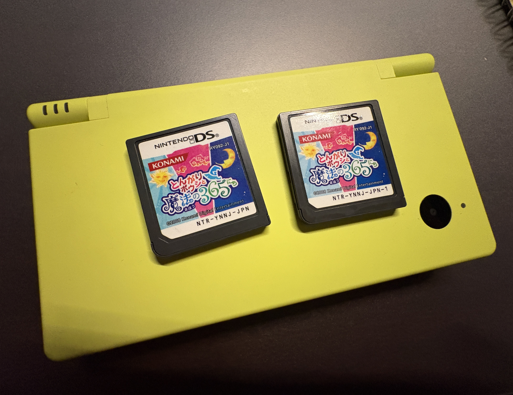

この前、久々にリサイクルショップに行った
家電コーナーが面白くて、nuphyのキーボードがわりといい値段（highではなくgood）で売られたりしていた

Logicoolのcombo touchが5000円くらいだった、新品だと2万くらいなので、わりとお得では？　使えればの話だが
今iPadを素で使っていて、ケースつけるか迷ってたので買うか迷ったが、さすがにQWERTY固定だろうと思って断念した

ゲームコーナーにも行った
DSソフトを見ていると、ケースなしのコーナーに*とんがりボウシと魔法の365日*があって、1320円で思わず買った
小学生の頃めちゃくちゃやってて、ワイアットとトラボルたが好きだった
トラボルたってジョン・トラボルタだろうが、小学生の頃は知らなかったし、言うほどジョン・トラボルタには似ていない
強いて言えば松潤ぽい
トラボルたをお茶会に誘い、洞窟で宝石を掘って、ラーメン屋でベリー（株）価予測を教えてもらっていた
虫図鑑と魚図鑑も好きだった、虫図鑑は口調が荒くて一見怖いが実は優しくて、魚図鑑は丁寧な物腰だが口に合わない魚を渡すと黙ってただ溜息を吐かれるみたいな感じだった気がする
第五人格の謝必安と范無咎が好きなルーツはおそらくこれだろう
巨が好きなルーツはボノロン

帰ってDSiでやろうとしたら、なぜか既にとんがりボウシが刺さっていた
去年同じような経緯で買っていたのである
意図せず二本持ちになってしまった
並べて眺めていると、下部の品番が違うことに気づいた
以前買った方には-1という追加ナンバーがついている

どうやら*バージョン違い*らしい
パッケージやデータが更新されると、品番に-1、-2とバージョン番号がつくようだ
今回買ったのはバージョン番号なし、つまり初期版で、前回買ったのはアップデート済ということになる
なら、実質別のソフトを買ったようなものだろう
知識も増えたし少し嬉しくなった
とんがりボウシと魔法の365日はバグの多さで有名だが、小学生の頃もそこそこフリーズしていた気がするので、初期版を持っていたのかもしれない

また忘れて来年三本目を買わずに済むように、今回はきちんとプレイしようと思う
バグは少ない方がいいので、前回買ったバージョンアップ版で
初期版は初期版という響きだけで満足できて嬉しい