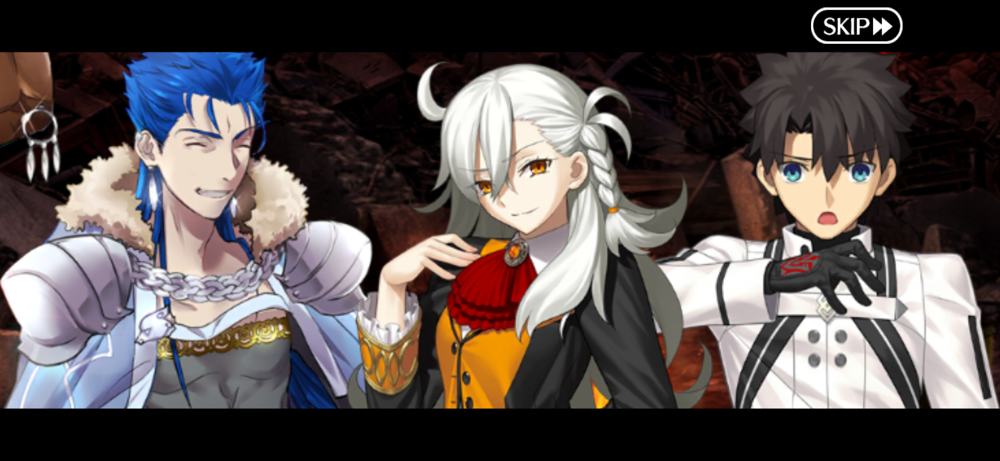
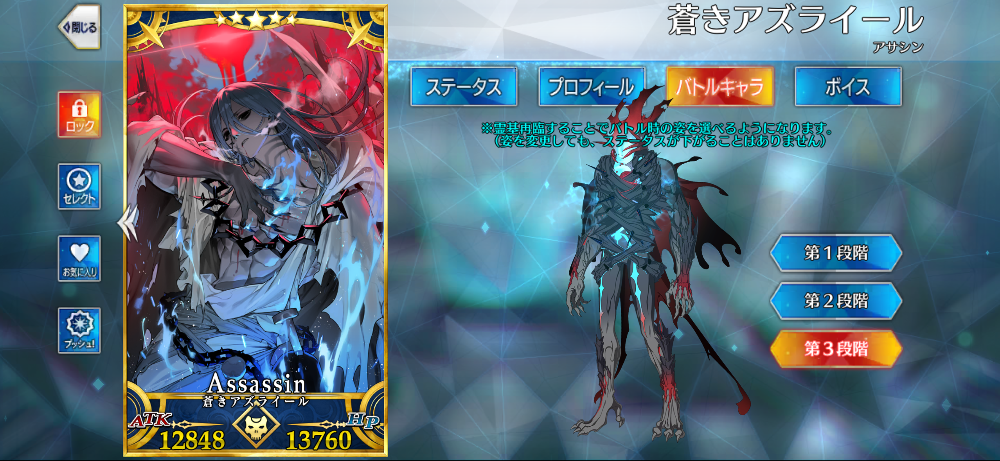

## この夏もっともアツいアイス
[「やわもちアイス 抹茶氷」季節限定発売のご案内 \| ニュースリリース \| 井村屋株式会社](https://www.imuraya.co.jp/news/2026/details487/)
これマジで美味すぎて三日に一回食べてる！
セブンのチョコミント氷も美味しい
ミスドの麺も美味しかった

## ダンスフェスに行った
KELO、TAKUMI、レジット、池田部屋、North Down Delayが出るなら行くしかない！てことで行った
みんなダンスうますぎや😭（当たり前）
2000円くらい追加して優先入場チケット買ったけど大正解だった、一般だと40℃近い炎天下で1時間半並ぶことになってた
言うて優先でも30分くらい並んだけど、、並んでる列のすぐ隣が出場者入場口で、一生分のギャル見れた　さすがにDリーグ組は見なかったけど
1000人くらいダンサーいたらしい　7時間ならそのくらいになるか
ダンスフェス初めて行ったけど、指定席がなくて、まず優先入場組が席取りゲームして、次に一般組が席取りゲームする
アリーナ中央の前から5列目くらいに座れた！
ステージ近いから低音がすごくて、こんな場所に7時間もいたら耳ぶっ壊れますよと思ったけど案外大丈夫だった、背骨はまだ痛いけど
スポットライトもガンガン当たって眩しいし楽しい

けろたくと池田部屋はダンスのみで、動画撮ってたから写真撮れなかったけど、レジットは喋り入れてくれて写真も撮れた
たくみとえなさんは動画で見たまんまって感じだったけど地獄さんはなんか違ったな　よりユニバのお兄さんという感じ
てかタイムスケジュールだと全部5分間のみで、せっかく九州まで来たんだから10分くらい踊って行きなさいよ😭（誰？）て思ってたけど、全員タイムスケジュール無視で5分以上踊ってた気がする！うれしい！ありがとう！
レジットとかCS作品2つともやってくれたし
クリスアッキーがささっと捌けていったのクリスアッキーでよかったな…

Dリーグ組以外もめちゃくちゃよかった
たぶん出演者として発表されてたのはコレオグラファー単体で、その人がやってる教室？のレッスン生とかと踊ってたんだと思う
ダンサーじゃないから予想なんですけど、ダンサーってガチで人脈が大事ぽい
作品前とか作品中に〇〇ー！みたいな感じで歓声というかコレオグラファーの名前叫んで応援してる知り合い？が必ず数人はいるんだけど、おそらく有名な人は歓声が明らかにデカかった
ダンサーって知り合いが踊ってるとき出来るだけ場を沸かそうとするというか、そういうカルチャーなんだと思う
歓声のタイミングが独特（技決めてるタイミングかと思いきや、え？そこで？みたいなところで歓声上がったりもする、謎）でオタクは迂闊に声出せず、、
でもマジで7時間ずっと沸いててすごかった
沸かしてくれたダンサーの人ありがとう

## Dリーグ
オフシーズンということで、各チームの脱退・加入情報が一斉に出ている
全チーム全員応援してるスタンスだけど、やっぱりその中でも特に好きなダンサーはいて、
KELO、JUMPEI、クリスアッキー、MEME、Runa Miura、Tenju、FatSnake、Keitric、YOICHIRO、MAKO、MAiKA（敬称略）

脱退：MEME、MAKO
マジか〜〜〜〜〜〜
MEME1年か〜〜　ガチでDリーグの伝説だ
もちろんMEMEだけじゃないけど、エースとかサイファーとかアワードとかの数字で見たとき、MEMEって明確にアイムーンの準優勝に貢献してると思うので、1年か〜〜そっか〜〜泣泣
MAKO そっか〜〜泣泣　Dリーグ本格的にハマったの和魂躍彩からだけど、MAKOのオモロ入場もきっかけの一つというか、作品超えて個のダンサーに興味持ったきっかけだから、悲しい
悲しいーーでもDリーグ以外でも踊り続けてくれたら嬉しい

一番ビビったのは世界さんのList::Xディレクター就任！
解説がチームディレクターになるのアリなんだ
やばすぎる！楽しみすぎる！でも世界さんより解説上手い人そうそういないと思うし、世界さんの~~シゲキックス大好きファンボーイ~~私情出てる解説好きだったからもう聞けないと思うとちょっと残念
いやまあリストのディレクターとシゲキのファンボーイは両立できるか
てか世界さんも踊ろう、解説でも若干踊っちゃってるときあったし
リストわりと個人中心にショーケース作ってるイメージあるけど世界さん就任で変わるのかな
来シーズンもZINの歌で踊るFatSnake見たいなー
Runa Miuraディレクションの無秩序・不条理も見たいし
あー全てが楽しみ
リスト推しの知人がますますツッコミ不足になったよ、、て言ってて笑った

## ObsidianのiOS共有シート対応が神
今までiOSショートカットか拡張機能のウェブクリッパーでクリップしてたけど、こないだのアプデで共有シートからウェブクリップできるようになった
神！
ショートカットはたまにクリップできない（特にWikipedia）、拡張機能は左上を押すのが面倒・右上の完了ボタンと下の保存ボタンが分かりにくい（右上の完了はキャンセルボタンで、下の保存を押すのが正解だが、見た目的につい右上を押してしまう）という欠点があったが、共有シートからLINEとかと同じやり方でウェブクリップできるようになった
保存フォルダも選べるしテンプレートも使えるし超〜〜便利！
デモページの動画、David Lynch Cooks Quinoa、デヴィッドリンチがキヌアとブロッコリーを調理する20分映画らしくて、謎　しかも評価良い
[‎David Lynch Cooks Quinoa (2007) directed by David Lynch • Reviews, film + cast • Letterboxd](https://letterboxd.com/film/david-lynch-cooks-quinoa/)

あとモバイル版の設定にインターフェースという新項目ができて、デザイン変更の幅が広がっている
去年だったか？iOS26に合わせてリキッドグラス風になったけど、個人的には前のフラットデザインの方が好きで、でも戻せないから諦めてた
今回のアプデで戻せるようになった！
やっぱこれだよこれ
と思ったらモバイルツールバーはそのままなんかい
今気づいた、ここ一番戻したいよ
まあ上下のバー戻せるだけでもありがたいです

## 最近やったゲームとか
- 第五人格の手記の加筆
一ヶ月遅れでやり出したけどおもろ〜
タスクあるからやること迷わないし程々に飽きないのが良いね
困難で囲まれてボコられてロストを2回やらかしたので、今はタスク消化しつつほぼ通常でやってる
気つけ薬2、注射、信仰、ゴーグル、復活壺みたいなやつ持って智者
敵だいたいスルーしてるけど通常ならメッセンジャーで敵と殴り合うのもいいかも
でも現状敵倒す旨みなさすぎなんよな
気分転換に色んな衣装着て行ってる、傭兵のチェシャ猫はモデル変更前のがよかったと思ってたけど、使ってみたら新モデルもかっこいい
コラボ敵強すぎるから早くコラボ終わってほしいです（怒られ）
- FGO
周年はモチベ上がるやつ
やっと終章読み出した、今検体Eの正体わかったところだけど予想よりおもろい、言い方ちょっと悪いけど
なんかFGOのシナリオの露悪的な部分というか、敵があからさまな悪ムーブして、主人公サイドが怒って、殴り合いして、勝つみたいな流れ見すぎてまあまあ飽きてたんだと思う
でもそれが王道だよな
オルガマリーってかわいい
これ好き、キャスニキとオルガマリーと藤丸とマシュでずっとキャンプファイヤーしながら駄弁っててほしい（人類の死）

アズライールのキャラデザ好きすぎて実装来ないかなー思ってたから嬉しい！
元々かっこいいのに再臨で激アツ人外になって感動した
関わった全ての人にありがとう
出てくるところまでシナリオ読んだら聖杯入れて100にしようと思ってたけど、先に上げて冠位にしてから読むのもアリかも
冠位3人目、聖杯入れるのサリエリぶり？岡田ぶり？
サリエリと岡田ってどっちが先輩だっけ
ベオウルフとニコラ・テスラが120で、サリエリと岡田は90がかわいいな〜と思って90で止めてる
長髪も人外もアツいアズライールのスクショで〆
