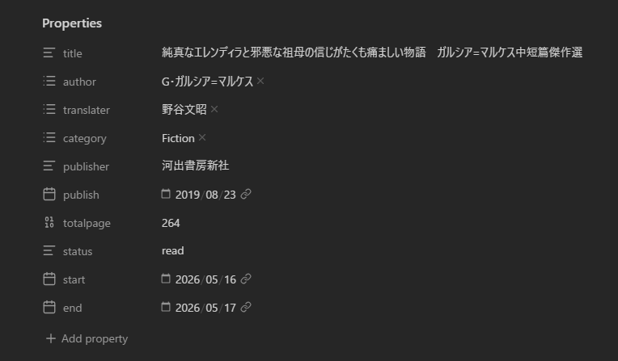

先日waveboxで、**1日〜1週間の中でobsidianをどのように使っていますか？** というご質問をいただいたので、そのアンサーの記事です！

## 主な用途
- デイリーノート
- ウィークリーノート
- ウェブクリップ
- 読書メモ
- テキスト（ブログ、リスト、小説とか）を書く

かなり緩めの使い方です
**フォルダのサブ階層を作らない**というマイルールの元、
- デイリーノート
- ウィークリーノート
- 作成したファイルが一旦入るフォルダ
- 読書メモ
- ウェブクリップ
- サイトで使うもの（ブログなど）
- 小説
- 勉強用
- アーカイブ（もう使わないが、後から見返すかもしれないノート）
- アセット（テンプレートや画像）

大体こんな感じでフォルダを分けています。
サブ階層を作らないのは、一度作り始めたらキリがなさそうだからです。
あとタグ機能も使わず、フロントマターはウェブクリップと読書メモのみ作成しています。
Obsidianはバックリンク使ってナンボみたいに言われがちですが、こちらもほぼ使ってないです　管理できる気がしないため…
管理に気を取られて、ノートを作るのが面倒だと思ってしまったら本末転倒なので、必要最小限を心がけています

### デイリーノート
私はデイリーノートを見返さないタイプなので、**その日で完結すること**だけ書くようにしています。
当日中に終わる小さいタスクや、空き時間を把握するための1時間単位の簡単なタイムスケジュールなどです。
メモはウィークリーノートで一覧で見返せるようにして、使えそうなものは別のメモ用ファイルに移動、使わなさそうなものはそのままにしています
その日作ったファイルの一覧は、一日で複数ファイル作って見比べながら作業したいときに地味に便利

それと、**いつでも見返したいファイル・リンク**を固定で置いてます！
好きな言葉まとめとか、SNSをダラダラ見たくなったときに代わりに見るようにしてるWikipediaのランダムリンクとか…
サイト改装中は、サイト改装やることリストを貼って、サイドバーを開かなくてもすぐ飛べるようにしていました。ゲーム中は実績チェックリストを貼ったりしてます。

日記も一時期つけようとしてたんですけど、見返しづらくて挫折してしまいました、、日記めちゃくちゃ見返したいタイプなので
日記はてがろぐか、紙の手帳に書くようにしてます。紙の方はなかなか書けてないですが笑　紙に書くのも楽しくて好きです！

### ウィークリーノート
デイリーノートのまとめです。
これは正直なくてもいいのですが、一週間分のウェブクリップとか作成ファイル一覧を見て、なんとなくいい気分😄になるために作ってます！あと今年何週目かの把握

### ウェブクリップ
公式のウェブクリッパーと、有志の方が公開してくださっているiOSショートカットを使ってます。
普通のウェブクリップの使い方をしていますが、フロントマターにdescriptionという欄を作って、**なぜこれを調べたのか**を明記するようにしています。
読書中に調べたことなら、その本のタイトルを書く感じです　調べた理由まで書いておくと、記憶に定着しやすいような気がします。

### 読書メモ
読書メモ用のフロントマターをあらかじめ作っておいて、Templaterでいつでも呼び出せるようにしています。
こんな感じ↓

前はBook Searchという本のタイトルを入れるだけで他の情報を自動取得してくれる神プラグインがあったのですが、Google Books API絡みで使えなくなってしまったので、手入力してます
フロントマター、目次、読みながら調べたこと（ウェブクリップしたならファイルへのリンク）、本文で気に入ったところや興味深かったところの要約や抜粋　を書いています

### テキストを書く
ブログ記事、リスト、メモ、小説など
Obsidianで作るリストは、今年やりたいこと・試した香水・好きなSCP記事など趣味関連のもので、生活や仕事などのタスクは別ツールで管理しています。通知機能がほしいため
小説でよく使う……と「」は、テンプレート機能を使ってモバイルツールバーに登録しています

## 使用プラグイン
### モバイル
- Templater
  読書メモなどのテンプレート
  JavaScriptが使えるので、カーソル操作を含むテンプレートを作れるのが便利（カーソルを中央に入れてカギ括弧を挿入、カーソル以降を全て選択とか）
- Dataview
  その日/その週に作ったノート/ウェブクリップの一覧作成
  その週作ったデイリーノートのメモ見出し内のテキストを抽出
- Calender
  Periodic Notesを入れると、カレンダーの日や週番号をクリックしてデイリー・ウィークリーノートが作れるようになる
- Periodic Notes
  ウィークリーノートを作る　デイリーノートはコアプラグインで作る
- Style Settings
  Thingsテーマの微調整
- Commander
  モバイルツールバーのアイコン変更　Templaterのテンプレートを挿入するコマンドはデフォルトだと< %だが、Commanderを入れて設定ファイルを直接書き換えることで、アイコンを変更可能
- Auto Link Title
  リンクを貼ると、自動でページタイトルを取得・入力してくれる
- Paste Image Rename
  画像を貼ると、画像タイトル変更・リンク表記をマークダウン記法にできる（デフォルトはwikiリンクで、サイトのビルド時に画像が反映されない）
- File Tree Alternative
  ファイルエクスプローラーのフォルダとファイルを分離表示する
- Furigana
  選択範囲にふりがなとrubyタグを挿入する
- Jisage
  全角字下げが反映されない問題を解決する
  Astroもそうなので、おそらくマークダウン記法そのものの仕様…
- Git
  GitHubと連携して、Cloudflare Workersで管理しているサイトのブログを更新できるようにする
  メインの保管庫はObsidian Syncで同期しているので、ブログ用の保管庫を別で作った
### PC
モバイルに入れているプラグインにいくつか追加
- tategaki-plugin
  開いているファイルの縦書きプレビューを表示する
  動作が不安定らしいが、直接編集もできる
- Typewriter Mode
  入力している行を画面中央に固定する
- Widgets
  ワークスペース内に時間と日付を表示するウィジェットを作る

## まとめ
どちらかというと自分用データベースのような使い方をしているので、日付で区切っている感覚があまりなく、Obsidian全体の話になってしまいました。
色々な情報や記事が出回っていますが、個人的には（楽しめる範囲内で）試行錯誤して、自分が続けやすい使い方を見つけるのが一番かな～と思ってます
何か参考になれば幸いです👍️